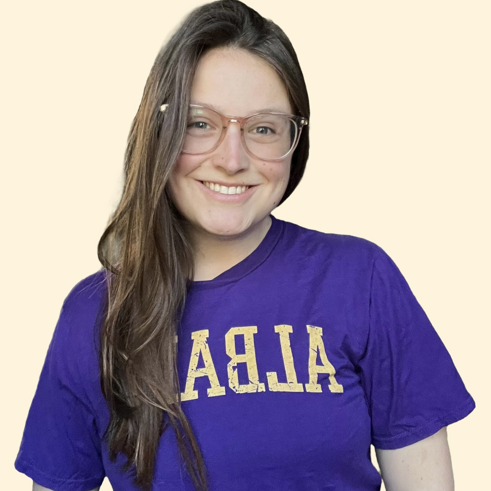

## About me

<strong> Welcome to my profile! </strong> 

::: {.grid}
::: {.g-col-4}

:::

::: {.g-col-8}
Hello, I'm <strong>Katie Baronowski</strong>  
🎓 PhD Student in Information Science 
🏫 State University of New York at Albany (UAlbany) 
📍 New York, USA  

🔬 **Research Interests**:  
- Information-driven algorithms 
- Odor-source localization
- Detection K9-technology interaction

Keywords: odor source localization; information-driven search algorithms; mobile sensing; detection dogs; UAS; spatial data science; applied AI; sensor fusion; human-animal-computer interaction

:::
:::

## Education

🎓 **PhD Student in Information Science**, State University of New York at Albany, USA (Aug 2024 – Present)   
  - Primary Specialization: Data Analytics
  - Secondary Specialization: TBD

🎓 **Bachelor of Technology in Canine Training and Management and Bachelor of Science in Applied Psychology**, SUNY Cobleskill, USA (Aug 2020 – May 2024)  
  - Outstanding Student in Psychology 2024.  
  - Student Leadership Award 2024.   
  - Honors Capstone: Canine discrimination of the enantiomers of carvone.

## Research Overview

My research explores the intersection of **Technological** and the **Biological**, developing AI algorithms that enhance **predication of target odor** and the **efficacy of search and rescue**.

## Updates

🏆 Received IFW **New Frontiers** Award (2026).  
✍️ Round goby detection dogs paper in R&R in **Biological Invasions** (2026).   
🚀 Received **AEOP Fellowship** (2025).
🏆 Received IFW **Women in Technology** Award (2025).   
📜 Attending **INTERSECT** bootcamp at Princeton New Jersey (2025).   
✍️ Submitted **1st manuscript** and as the first author (2025).
🚀 Mentoring undergraduate students in the **Mobile Sensor Lab** at UAlbany (ongoing).

## Quick Links

🔬 [Research](/research/index.html)  
🎓 [Academic Experience](/academic.html)  
💼 [Professional Experience](/professional.html)  
🛠️ [Practical Projects](/projects.html)  
📝 [Blog](/blog/index.html)  
📄 [CV](/cv.pdf)

## Contact  
📧 [kbaronowski@albany.edu](mailto:kbaronowski@albany.edu)   

Thank you!
